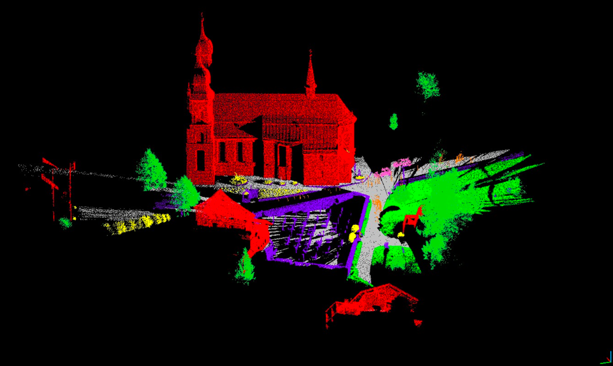
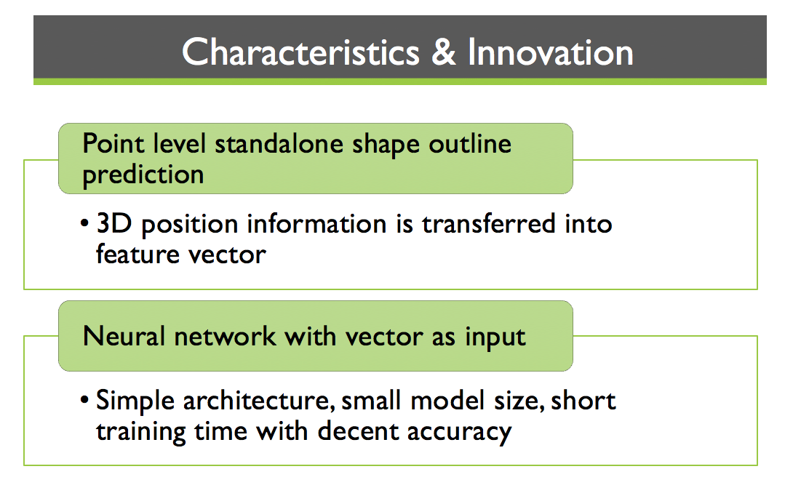
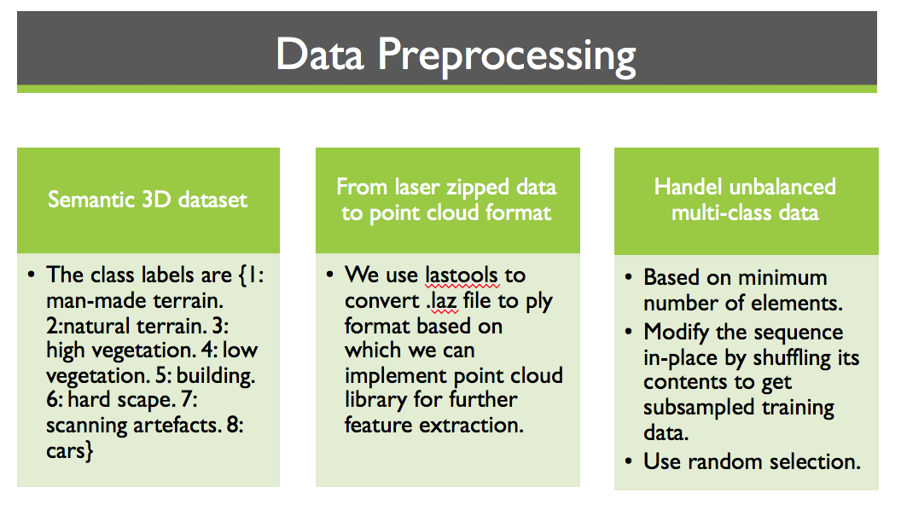
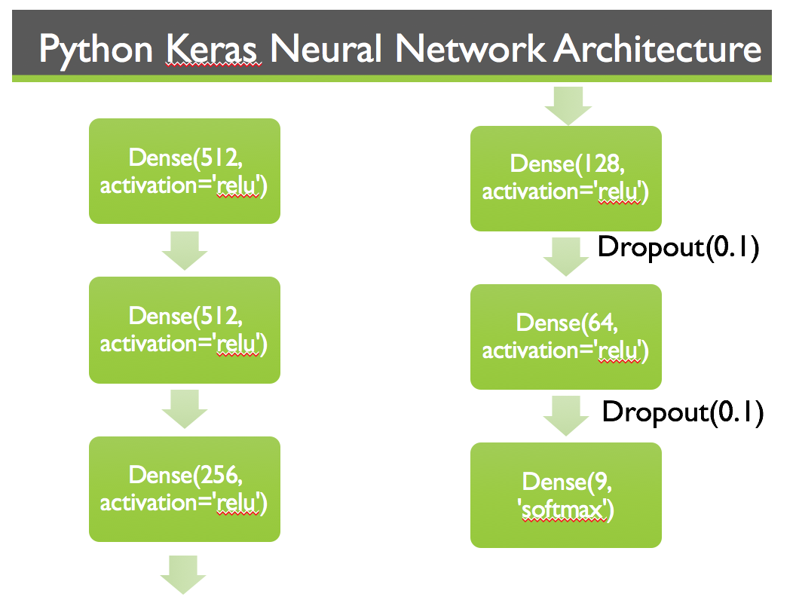

# 3D-Semantic-Segmentation-for-Scene-Parsing

loadplypipeline directory is for feature vector abstracting

neural network directory is for neural network

### Project Overview
3D scanners have been largely used in 3D environment reconstruction and modelling. However, the large scale scanned data lacks of structure and semantic interpretation. Our project provides an automated approach to do semantic segmentation for 3D point cloud.                      

Firstly, we estimated the shape outline through SIFT3D keypoint extraction and normal estimation, we extracted the local feature of the point cloud and then reduce the 3D image dimension from three to one. Then we build one neural network model for the semantic label classification. Finally, we re-projected the 1vector with predicted label to 3D point cloud for color visualization 

     